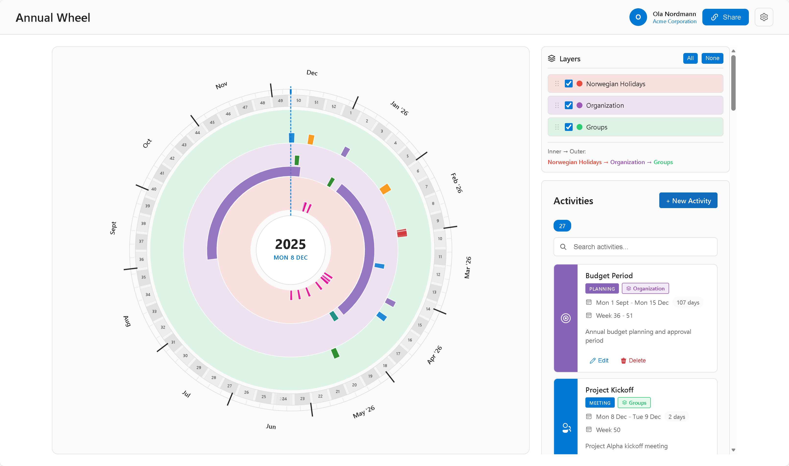

# Annual Wheel

A Microsoft Teams app for visualizing and managing annual activities in an interactive circular calendar format.



## Purpose

Annual wheels helps organizations plan and visualize their yearly activities, events, deadlines, and milestones in an intuitive wheel format. The circular design provides a unique bird's-eye view of the entire year, making it easy to:

- **See the big picture** - Visualize all activities across the year at a glance
- **Plan ahead** - Identify busy periods and gaps in scheduling
- **Collaborate** - Share calendars with teams and stakeholders
- **Stay organized** - Categorize activities by type and layer (department, team, project)

## Capabilities

### Interactive Annual Wheel
- Circular calendar visualization with 12 months
- Color-coded activities by type (meetings, deadlines, events, holidays, etc.)
- Hover to see activity details, click to edit
- Today indicator and current week highlight

### Activity Management
- Create, edit, and delete activities
- Support for repeating activities (weekly, bi-weekly, monthly)
- Categorize by activity type with custom colors and icons
- Assign activities to different layers (organization, groups, custom)

### Layer System
- Multiple layers (rings) for different organizational levels
- Toggle layer visibility
- Automatic holiday layer with public holidays from Nager.Date API
- Custom layers for departments, teams, or projects

### Multi-language Support
- Norwegian Bokmål (nb)
- Norwegian Nynorsk (nn)
- Northern Sami (se)
- English (en)
- Automatic language detection from Teams SDK

### Sharing
- Generate share links for public or organization-only access
- Embed code for websites
- Configurable display settings (theme, legend, title)

### Admin Settings
- Configure activity types with custom colors and icons
- Manage layers and their display order
- Role-based access control

## Tech Stack

| Component | Technology |
|-----------|------------|
| **Frontend** | Svelte 5, TypeScript, Vite |
| **UI Components** | Fluent UI Web Components |
| **Platform** | Microsoft Teams (Teams Toolkit) |
| **Backend API** | Rust (Actix-web) |
| **Database** | Azure Cosmos DB |
| **Hosting** | Azure Static Web Apps |
| **Authentication** | Microsoft Entra ID (Azure AD) |

## Project Structure

```
arshjul/
├── api/              # Rust backend API
│   └── src/
├── teams-app/        # Svelte frontend
│   ├── src/
│   │   ├── components/   # Svelte components
│   │   ├── services/     # API and utility services
│   │   ├── locales/      # i18n translation files
│   │   └── types/        # TypeScript type definitions
│   └── appPackage/       # Teams app manifest
└── docs/             # Documentation and images
```

## Getting Started

### Prerequisites
- Node.js 22+
- Teams Toolkit extension for VS Code
- Azure subscription (for deployment)

### Development

```bash
# Install dependencies
cd teams-app
npm install

# Start development server
npm run dev

# Build for production
npm run build
```

### Deploy to Teams

1. Open the project in VS Code with Teams Toolkit
2. Sign in to your Microsoft 365 account
3. Press F5 to launch in Teams

## License

MIT License - See LICENSE file for details.
